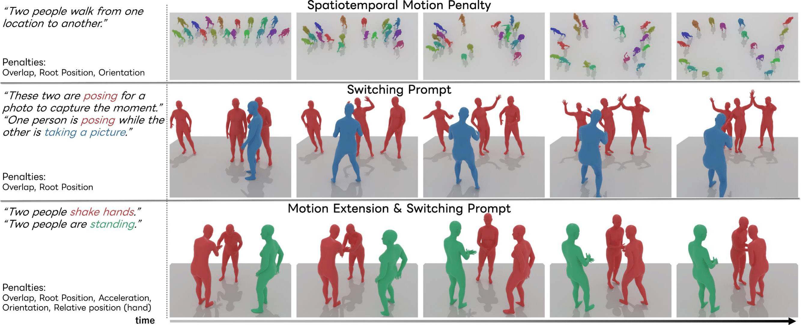

# <p align="center"> PINO: Person-Interaction Noise Optimization for Long-Duration and Customizable Motion Generation of Arbitrary-Sized Groups (ICCV 2025) </p>

## [Project Page](https://sinc865.github.io/pino/) 



This is the official code for the paper "PINO: Person-Interaction Noise Optimization for Long-Duration and Customizable Motion Generation of Arbitrary-Sized Groups".


##  Getting started
This code was tested on Red Hat Enterprise Linux 9.4 and requires:

- Python 3.8

- [uv](https://github.com/astral-sh/uv) (for environment management)

- NVIDIA H100 (or a similar CUDA-capable GPU)

If you don't have uv installed, you can install it with:
```
curl -LsSf https://astral.sh/uv/install.sh | sh
```


### 1. Setup environment

```
uv sync
. .venv/bin/activate
```

### 2. Get InterHuman Data

Please download the InterHuman dataset from [here](https://tr3e.github.io/intergen-page/). If you use this dataset, please make sure to cite the original paper.

### 3. Download Pretrained and Evaluation Models from InterGen

Run the shell script:
```
.prepare/download_pretrain_model.sh
.prepare/download_evaluation_model.sh
```

##  Demo

### 1. Generate a Two-Person Interaction
```
python tools/infer_opt.py --prompt "Two people danced at the party."
```


### 2. Scale to N-Person (3+)
You need motion data that includes at least two generated people.

The first person will be used as a hub, and additional people will be generated one by one in interaction with them.
```
python tools/infer_opt.py --prompt "Two people danced at the party." --motion_path results/Two_people_danced_at_the_party_2.pt
```

For detailed motion control, refer to [here](https://github.com/sinc865/PINO/blob/main/tools/infer_opt.py#L179).


##  Acknowledgement
Our code is mainly based on [InterGen](https://github.com/tr3e/InterGen). In addition, part of the code is adapted from [progmogen](https://github.com/HanchaoLiu/ProgMoGen).


##  Citation
```
@inproceedings{ota2025pino,
    title     = {PINO: Person-Interaction Noise Optimization for Long-Duration and Customizable Motion Generation of Arbitrary-Sized Groups},
    author    = {Ota, Sakuya and Yu, Qing and Fujiwara, Kent and Ikehata, Satoshi and Sato, Ikuro},
    booktitle = {Proceedings of the IEEE/CVF International Conference on Computer Vision (ICCV)},
    year      = {2025},
}
```